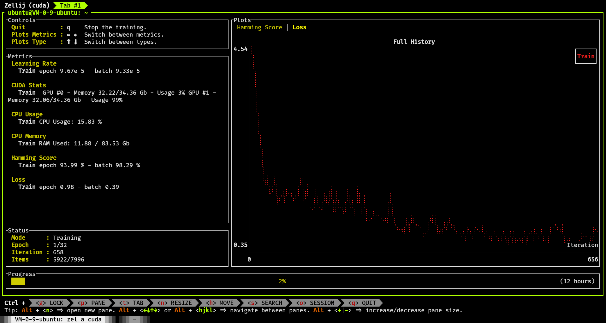
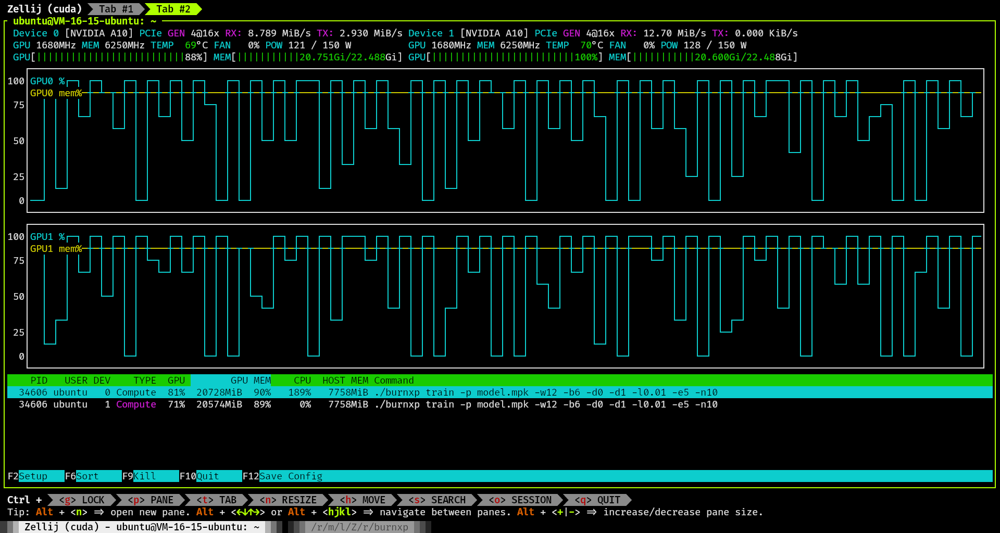

# About the Project

This project is one of the components of `the digital me` (WIP),
which aims to clone oneself to some extent.

This component `burnxp` is for cloning one's `Aesthetics Preferences`, also known as `XP`(性癖) in Chinese.

Based on [burn](https://github.com/tracel-ai/burn), `burnxp` can train a ResNet model to score pictures
according to owner's sesthetics preferences.

Based on [ratatui](https://github.com/ratatui/ratatui), `tagger` can aid in tagging pictures by
iteractively comparing the degree of compliance with sesthetics preferences.

Based on [argmin](https://crates.io/crates/argmin), `tagger divide` can help in dividing the dataset into label-balanced train-set and valid-set.

## Tagger

<table>
    <tr>
        <td>
            
            <br />
        </td>
        <td>
            
            
        </td>
    </tr>
</table>


Features:
- `tagger pick` subcommand can help pick the images to be tagged **(super fast image viewer in terminal)**
- `tagger tag` subcommand to label pictures
- `tagger divide` subcommand can help divide the images into train-set and valid-set, an efficient solver to balance labels and compute weight
- `tagger observe` subcommand can help observe the distribution of labels

## Trainer



multi-gpu training is supported.



## Predictor

(outdated screenshot, will update soon)


# Usage

**Cuda 12.x should be installed** for non-macOS users.

Torch version (recommended) depends on `libtorch` to accelerate, please set it up with provided `dist/setup` scripts.
Instead, candle version can work independently
(known issue: 1. [cuda 12.6 unusable](https://github.com/huggingface/candle/issues/2410); 2. `max_pool` and `avg_pool` are not well-supported, which leads candle version actually unusable).

## 1. Use compiled release

You can download the `burnxp` and `tagger` in the [release page](https://github.com/kingwingfly/burnxp/releases).

Note that `tagger` is released independently. `burnxp-xx` with `f16` is half-precision version. `Candle` version is currently not usable.

```sh
# torch-version only, candle version can skip this setup
# you can also setup manually like this script if you have libtorch else where
run/setup.xx
run/burnxp.xx
./tagger.xx
# xx is the suffix of executable file based on your OS
```

## 2. Compile yourself

```sh
git clone git@github.com:kingwingfly/burnxp.git
# torch-version only, candle version can skip this setup
scripts/setup_<your_os>.xx
# torch-version and macOS only, candle version can skip this
source .venv/bin/activate

cargo build -p tagger --release
cargo build -p burnxp --release
# or half-precision version
cargo build -p burnxp --release -F f16
```

# Note

The `tagger` works well in `kitty` `iTerm2` and `wezterm` while maybe not in other terminals (like `Warp`).

For Windows, I tried my best but failed to make it work perfectly.
`wezterm` can be used and please just set font size to 18 to meet the preset.

A `Tauri` version may be under development.

# TODO

- [ ] CLIP model instead of ResNet model
- [ ] Make `candle` version usable

# Contributing

If you are working with feature `tch`:

Please setup all needed environment variables like `scripts/setup` before coding, or your IDE may not work well.

For macOS users, you need also activate python venv before coding.

Do not use nightly version of Rust.

If you are working with feature `candle` (ususable now due to pooling not supported well),
need CUDA<=12.4.1, nothing else to configure, just enjoy coding.

# License

MIT LICENSE
